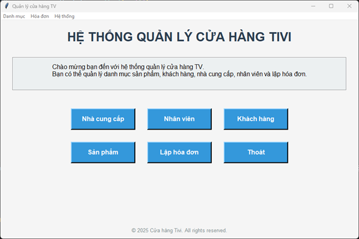

# 📦 **QUẢN LÝ CỬA HÀNG TIVI – PYTHON TKINTER**

> Ứng dụng quản lý cửa hàng tivi hỗ trợ nhập hàng, bán hàng, quản lý sản phẩm – khách hàng – nhân viên – nhà cung cấp, in hóa đơn và xuất dữ liệu Excel.
> Phát triển bằng **Python + Tkinter + MySQL**.

---

## 📸 **Giao Diện Minh Họa**

<p style="text-align:center;">
  
</p>


---

## 🚀 **Tính Năng Chính**

### 🔹 **1. Quản lý dữ liệu**

* Nhân viên
* Khách hàng
* Nhà cung cấp
* Sản phẩm (liên kết nhà cung cấp)

CRUD đầy đủ: **Thêm – Sửa – Xóa – Tìm kiếm – Xuất Excel**.

---

### 🔹 **2. Lập Hóa Đơn Bán Hàng**

* Chọn nhân viên – khách hàng
* Chọn sản phẩm, số lượng, giá
* Tính tổng tự động
* Lưu xuống CSDL MySQL
* Xuất hóa đơn dạng **Excel (mẫu đẹp, có viền, căn chỉnh)**

---

### 🔹 **3. Lập Phiếu Nhập Kho**

* Chọn nhân viên, nhà cung cấp
* Nhập danh sách sản phẩm + giá nhập
* Tự động tính tổng
* Lưu + xuất file Excel

---

### 🔹 **4. Tự động tải dữ liệu từ MySQL**

* Khi mở phần mềm, tất cả thông tin đều được load từ CSDL
* TreeView hiển thị dữ liệu rõ ràng

---

### 🔹 **5. Tổ chức mã nguồn tái sử dụng**

* CRUD chung bằng hàm `open_crud()`
* Module hóa đơn – phiếu nhập tách riêng
* Kết nối MySQL thông qua `connect_mysql()`

---

## 🛠 **Công Nghệ Sử Dụng**

| Thành phần    | Công nghệ                   |
| ------------- | --------------------------- |
| Ngôn ngữ      | Python 3.x                  |
| Giao diện     | Tkinter                     |
| Cơ sở dữ liệu | MySQL / MariaDB             |
| Xuất File     | openpyxl                    |
| Widget hỗ trợ | ttk, tkcalendar             |
| Kiến trúc     | Multi-Module, Reusable CRUD |

---

## 🗂 **Cấu Trúc Thư Mục**

```
project/
│── db.py                  # Kết nối MySQL
│── main.py                # File chạy chính
│── invoices.py            # Lập hóa đơn + xuất file
│── receipts.py            # Phiếu nhập kho
│── crud.py                # Hàm CRUD tái sử dụng
│── screenshots/           # Ảnh giao diện
│── README.md
```

---

## ⚙️ **Cài Đặt & Chạy**

### **1. Clone project**

```bash
git clone https://github.com/playrough/DoAnPython-NhomDoAn-10-25PM-Nhom4-To2.git
cd DoAnPython-NhomDoAn-10-25PM-Nhom4-To2 
```

### **2. Cài thư viện Python**

```bash
pip install mysql-connector-python tkcalendar openpyxl
```

### **3. Tạo database MySQL**

```sql
CREATE DATABASE quanlytivi;
USE quanlytivi;
```


### **4. Cấu hình kết nối MySQL**

Trong `db.py`:

```python
def connect_mysql():
    return mysql.connector.connect(
        host="localhost",
        user="root",
        password="your_password",
        database="quanlytivi"
    )
```

### **5. Chạy chương trình**

```bash
python main.py
```

---

## 🔧 **Hướng Phát Triển**

* Phân quyền người dùng
* Xuất hóa đơn PDF chuyên nghiệp
* Biểu đồ thống kê doanh thu
* Cảnh báo tồn kho thấp
* Giao diện UI nâng cấp (PyQt / Web)
* Cloud Database

---

## 👨‍💻 **Tác Giả**

**Tên:** Phạm Quang Minh  
**Mã:** DTH195310  
**Lớp:** DH20TH1  
**Trường:** Đại học An Giang  

---

## ⭐ **Nếu bạn thấy project hữu ích – Hãy ⭐ Star Repo để ủng hộ!**